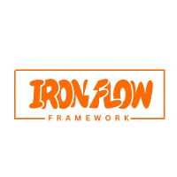

# IronFlow Framework

<div align="center">



[](https://php.net)
[](LICENSE)
[](https://github.com/ironflow/framework/actions)
[](https://codecov.io/gh/ironflow/framework)
[](https://github.styleci.io/repos/ironflow/framework)

</div>

## 📋 Table des matières

- [Présentation](#présentation)
- [Fonctionnalités](#fonctionnalités)
- [Prérequis](#prérequis)
- [Installation](#installation)
- [Configuration](#configuration)
- [Utilisation](#utilisation)
- [Migrations](#migrations)
- [Développement](#développement)
- [Tests](#tests)
- [Contribuer](#contribuer)
- [License](#license)

## À propos

IronFlow est un framework PHP moderne, performant et modulaire, conçu pour simplifier le développement d'applications web tout en offrant une base solide et extensible. Il combine puissance et simplicité pour accélérer votre développement.

## Caractéristiques principales

- Architecture MVC moderne et flexible
- Système de routage intuitif et performant
- ORM puissant avec relations fluides
- Système de templates Twig
- Gestion avancée des sessions et du cache
- Système d'authentification robuste
- Validation des données complète
- Gestion des événements et des listeners
- Support multi-langues
- Système de migrations de base de données
- Console CLI puissante
- Support des WebSockets
- Panneau d'administration intégré (CraftPanel)

## 🌟 Fonctionnalités Clés

### Performance

- Architecture légère et optimisée
- Système de cache intégré
- Chargement différé des composants
- Optimisation automatique des requêtes

### Sécurité

- Protection CSRF intégrée
- Validation des données robuste
- Échappement automatique des sorties
- Gestion sécurisée des sessions

### Développement

- ORM puissant avec relations fluides
- Système de routage intuitif
- Gestionnaire de dépendances intégré
- Support natif des tests unitaires

### Extensibilité

- Architecture modulaire
- Système de plugins
- Hooks et événements personnalisables
- Support multi-drivers

## 📋 Prérequis Système

- PHP 8.2 ou supérieur
- Composer 2.0+
- Extensions PHP requises :
  - PDO
  - JSON
  - Mbstring
  - OpenSSL
  - Tokenizer
  - XML
- Une base de données MySQL, PostgreSQL ou SQLite
- Un serveur web (Apache, Nginx, etc.)

## 🚀 Installation Rapide

### Via Composer

```bash
# Création du projet
composer create-project ironflow/framework mon-projet

# Configuration
cd mon-projet
cp .env.example .env

# Génération de la clé d'application
php forge key:generate

# Installation des dépendances
composer install

# Configuration des permissions
chmod -R 777 storage bootstrap/cache
```

### Manuellement

1. **Cloner le repository**:

   ```bash
   git clone https://github.com/ironflow/framework.git
   cd framework
   ```

2. **Installer les dépendances**:

   ```bash
   composer install
   ```

3. **Configurer l'environnement**:

   ```bash
   cp .env.example .env
   php forge key:generate
   ```

4. **Lancer le serveur**:

   ```bash
   php forge serve
   ```

   Votre application est maintenant accessible à l'adresse [http://localhost:8000](http://localhost:8000)

## 📁 Architecture du Projet

```
mon-projet/
├── app/                    # Code de l'application
│   ├── Controllers/       # Contrôleurs
│   ├── Models/           # Modèles
│   ├── Middleware/       # Middleware
│   └── Providers/        # Providers
├── config/                # Fichiers de configuration
├── database/              # Migrations et seeders
├── public/                # Point d'entrée public
├── resources/             # Ressources (vues, assets)
├── routes/                # Définition des routes
├── src/                   # Code source du framework
├── storage/               # Fichiers générés
├── tests/                 # Tests unitaires et fonctionnels
└── vendor/                # Dépendances
```

## ⚙️ Configuration

### Base de données

```ini
DB_CONNECTION=mysql
DB_HOST=127.0.0.1
DB_PORT=3306
DB_DATABASE=ironflow
DB_USERNAME=root
DB_PASSWORD=password
```

### Email

```ini
MAIL_MAILER=smtp
MAIL_HOST=smtp.mailtrap.io
MAIL_PORT=587
MAIL_USERNAME=username
MAIL_PASSWORD=password
MAIL_ENCRYPTION=tls
MAIL_FROM_ADDRESS=hello@example.com
```

### Cache

```ini
CACHE_DRIVER=file
CACHE_PREFIX=ironflow_
CACHE_TTL=3600
```

## 🛠️ Commandes Forge

### Génération de Code

```bash
# Création de contrôleurs
php forge make:controller UserController

# Création de modèles
php forge make:model User

# Création de migrations
php forge make:migration create_users_table

# Création de seeders
php forge make:seeder UserSeeder
```

### Base de données

```bash
# Exécution des migrations
php forge migrate

# Annulation des migrations
php forge migrate:rollback

# Exécution des seeders
php forge db:seed

# Réinitialisation de la base de données
php forge migrate:fresh --seed
```

### Maintenance

```bash
# Nettoyage du cache
php forge cache:clear

# Optimisation
php forge optimize

# Vérification de l'état
php forge status
```

## 🛠️ Exemple d'utilisation

### Créer une route

```php
// routes/web.php
Route::get('/accueil', [HomeController::class, 'index']);
Route::post('/articles', [ArticleController::class, 'store']);
Route::resource('users', 'UserController');
```

### Créer un contrôleur

```bash
php forge make:controller HomeController
```

```php
// app/Controllers/HomeController.php
namespace App\Controllers;

use IronFlow\Http\Controller;
use IronFlow\Http\Request;
use IronFlow\Http\Response;

class HomeController extends Controller
{
    public function index(Request $request)
    {
        return $this->view('home.index', [
            'title' => 'Accueil'
        ]);
    }
}
```

### Créer un modèle

```bash
php forge make:model Article
```

```php
// app/Models/Article.php
namespace App\Models;

class Article extends Model
{
    protected $table = 'articles';

    protected $fillable = ['title', 'content', 'author_id'];

    protected $casts = [
        'created_at' => 'datetime',
        'updated_at' => 'datetime'
    ];

    public function author()
    {
        return $this->belongsTo(User::class, 'author_id');
    }
}
```

## 🗃️ Migrations

### Créer une migration

```bash
php forge make:migration create_articles_table
```

```php
// database/migrations/2023_01_15_create_articles_table.php
public function up()
{
    Schema::createTable('articles', function (Anvil $table) {
        $table->id();
        $table->string('title');
        $table->text('content');
        $table->foreignId('author_id')->constrained('users');
        $table->timestamps();
    });
}

public function down()
{
    Schema::dropTableIfExists('articles');
}
```

### Exécuter les migrations

```bash
php artisan migrate
```

## 📚Documentation

La documentation complète est disponible sur [https://ironflow.dev/docs](https://ironflow.dev/docs)

### Sections principales

- [Guide de démarrage](https://ironflow.dev/docs/getting-started)
- [Architecture](https://ironflow.dev/docs/architecture)
- [Base de données](https://ironflow.dev/docs/database)
- [Sécurité](https://ironflow.dev/docs/security)
- [Tests](https://ironflow.dev/docs/testing)

## 🤝 Contribution

Nous accueillons chaleureusement les contributions ! Voici comment participer :

1. Fork le projet
2. Créez une branche (`git checkout -b feature/AmazingFeature`)
3. Committez vos changements (`git commit -m 'Add some AmazingFeature'`)
4. Poussez vers la branche (`git push origin feature/AmazingFeature`)
5. Ouvrez une Pull Request

### Standards de Code

- Suivez les standards PSR-12
- Ajoutez des tests unitaires
- Mettez à jour la documentation
- Respectez notre [Guide de Contribution](CONTRIBUTING.md)

## 📄 Licence

Ce projet est sous licence MIT. Voir le fichier [LICENSE](LICENSE) pour plus de détails.

## 👥 Équipe

- [Aure Dulvresse](https://github.com/auredulvresse) - Lead Developer
- [Autre Membre](https://github.com/autre-username) - Core Developer

## 📞 Support

- Documentation : [https://ironflow.dev/docs](https://ironflow.dev/docs)
- Issues : [GitHub Issues](https://github.com/ironflow/framework/issues)
- Discussions : [GitHub Discussions](https://github.com/ironflow/framework/discussions)
- Email : ironflow.framework@gamil.com

## 🙏 Remerciements

- [PHP](https://www.php.net/) - Le langage de programmation
- [Composer](https://getcomposer.org/) - Gestionnaire de dépendances
- [PDO](https://www.php.net/manual/fr/book.pdo.php) - Extension de base de données
- [Symfony Components](https://symfony.com/components) - Composants réutilisables
- [Laravel](https://laravel.com/) - Inspiration pour certaines fonctionnalités
- [Ruby On Rail](https://rubyonrails.org/) - Inspiration pour certaines fonctionnalités
- [Django](https://www.djangoproject.com/) - Inspiration pour certaines fonctionnalités

---

<div align="center">
Forgé avec passion et ❤️ by the IronFlow Team
</div>
